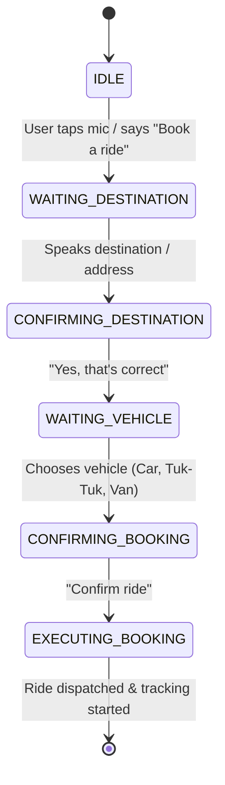

# <p align="center">🚗 AccessRide Frontend</p>

<p align="center">
  <strong>Next-Generation Accessible, Voice-Powered Ride-Hailing Web Application</strong>
</p>

<p align="center">
  
  
  
  
  
</p>

---

## 🌟 Overview

**AccessRide Frontend** is a modern React application built with accessibility as a core foundation. It delivers a voice-navigable, hands-free experience empowering persons with disabilities, elderly riders, daily passengers, drivers, and fleet managers.

---

## 🎙️ AI Voice Assistant Capabilities & Architecture

The platform features an **AI Voice Assistant** operating across multiple modules:



### Key Voice Assistant Features:
- 🗣️ **Conversational Ride Booking**: Automatically detects pickup/dropoff locations (*"Take me to Kandy Hospital"*, *"Use my current location and go to Colombo Fort"*).
- 📅 **Natural Language Date & Time Parsing**: Supports relative schedules (*"Book for tomorrow at 3 PM"*, *"Schedule for next Monday morning"*).
- 📝 **Voice Registration with Smart Empty-Field Detection**:
  - Automatically identifies which form fields are already filled.
  - Skips filled inputs and prompts *only* for missing details.
  - Automatically resets and restarts from the beginning only if an unresolvable registration error occurs.
- 🔊 **Strict Single-Voice Audio Engine**:
  - Eliminates overlapping or duplicate speech across all modern browsers.
  - **Google Chrome & Brave**: High-fidelity natural voice output.
  - **Microsoft Edge**: Native online natural voices (`Jenny`, `Aria`).
  - **Apple Safari (macOS / iOS)**: Clean, clear speech synthesis (`Samantha`, `Karen`).

---

## ✨ Feature Highlights

### 🗺️ 1. Interactive Maps & GPS Navigation
- Live Mapbox GL rendering with dynamic route polylines and turn-by-turn navigation.
- Real-time GPS location snapping with reverse geocoding.
- Animated vehicle markers and live ETA calculation.

### 🚗 2. Multi-Role Portals

#### 👤 Rider Dashboard
- Instant & Scheduled ride booking.
- Ride history, invoices, and driver ratings.
- Emergency SOS button triggering automatic SMS alerts with live GPS tracking links.

#### 🚖 Driver Portal
- Real-time trip request notifications and acceptance.
- Turn-by-turn navigation overlay.
- Multi-document upload onboarding (License, NIC, Registration, Insurance, Vehicle photos).
- Revenue breakdown and monthly rating tracker.

#### 🛡️ Admin Command Center
- **Driver Verification Center**: Inspect submitted high-resolution driver licenses, NICs, and vehicle photos with built-in lightbox inspector.
- **Fleet Monitor**: Track driver statuses, active trips, and completed rides.
- **Analytics & Reporting**: Monthly revenue reports and growth charts.

---

## 🛠️ Tech Stack

| Category | Technology |
| :--- | :--- |
| **Framework** | [React 18](https://react.dev/) + [Vite](https://vitejs.dev/) |
| **Styling** | [Tailwind CSS](https://tailwindcss.com/) + Custom Design System |
| **Routing** | [React Router DOM v6](https://reactrouter.com/) |
| **Icons** | [Lucide React](https://lucide.dev/) |
| **Maps** | [Mapbox GL JS](https://www.mapbox.com/) |
| **Voice & Audio** | Web Speech API + OpenAI TTS Stream Integration |
| **Performance** | [@vercel/speed-insights](https://vercel.com/docs/speed-insights) |

---

## 📁 Directory Structure

```bash
frontend/
├── public/               # Static assets & public icons
├── src/
│   ├── admin/            # Admin Management Portal (Dashboard, Drivers, Users, Reports)
│   ├── config/           # API configuration (API_BASE, environment mapping)
│   ├── DriverDashboard/  # Driver Portal (Trip dispatch, Navigation, Earnings, Documents)
│   ├── login/            # Authentication (User Login/Register, Driver Login/Register, Admin Login)
│   ├── pages/            # User Profile, History, Ride Tracking, Emergency SOS
│   ├── UserDashboard/    # Rider Booking, Schedule advance rides, Voice Assistant
│   │   └── components/
│   │       └── voiceassistant/ # Speech engine, VoiceAssistantButton, single-voice controller
│   ├── App.jsx           # Master route registry & Speed Insights provider
│   └── main.jsx          # React DOM entrypoint
├── index.html
├── package.json
├── tailwind.config.js
└── vite.config.js
```

---

## 🚀 Getting Started

### Prerequisites
- Node.js (v18 or higher)
- npm or yarn

### Installation

1. **Clone repository:**
   ```bash
   git clone https://github.com/quintusjonath-jemy/accessride.git
   cd accessride/frontend
   ```

2. **Install dependencies:**
   ```bash
   npm install
   ```

3. **Configure Environment Variables:**
   Create a `.env` file in the `frontend` root:
   ```env
   VITE_API_BASE=your_backend_api_url_here
   VITE_MAPBOX_TOKEN=your_mapbox_public_token_here
   ```

4. **Start Development Server:**
   ```bash
   npm run dev
   ```

5. **Build for Production:**
   ```bash
   npm run build
   ```

---

## 👥 Contributors & Team Members

<table align="center">
  <tr>
    <td align="center" width="25%">
      <a href="https://github.com/quintusjonath-jemy">
        
        <br />
        <sub><b>Quintus Jonath</b></sub>
      </a>
      <br />
      <span style="font-size:12px;color:#888;">Lead Developer</span>
    </td>
    <td align="center" width="25%">
      <a href="https://github.com/kabil0507">
        
        <br />
        <sub><b>Kabilan</b></sub>
      </a>
      <br />
      <span style="font-size:12px;color:#888;">Full-Stack Developer</span>
    </td>
    <td align="center" width="25%">
      <a href="https://github.com/KRITHIKA3006">
        
        <br />
        <sub><b>Krithika</b></sub>
      </a>
      <br />
      <span style="font-size:12px;color:#888;">Developer & UI/UX</span>
    </td>
    <td align="center" width="25%">
      <a href="https://github.com/nithan11">
        
        <br />
        <sub><b>Nithan</b></sub>
      </a>
      <br />
      <span style="font-size:12px;color:#888;">Developer & QA</span>
    </td>
  </tr>
</table>

---

<p align="center">
  Made with ❤️ by the AccessRide Team
</p>
